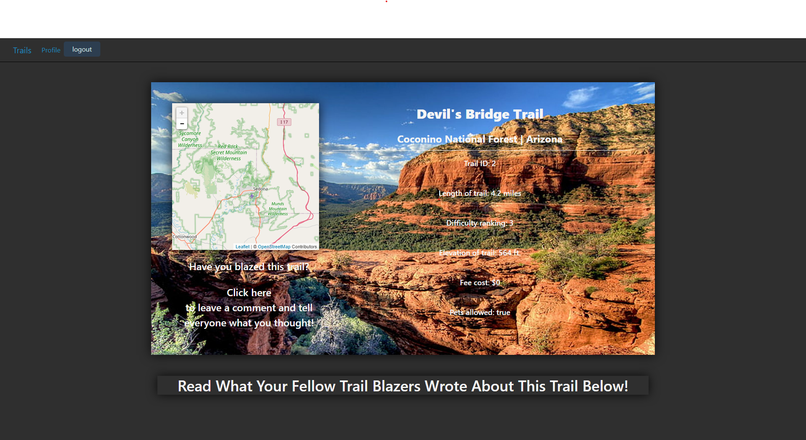

# Trail Blazers

# Description

Once a user signs in, they will have access to a list of the top trails in America. By navigating to a trail's page, the user will be presented with relevant information about the trail. For example, the difficulty of the trail, if pets are allowed, and more. They will see comments about the trail from reviewers and have the ability to post comments as well. 

  

  ## Table of Contents
  1. [Description](#description)
  2. [Installation](#installation/deployment)
  3. [Usage](#usage)
  4. [Our&#32;Application](#our&#32;application)
  5. [License](#license)
  6. [Contact&#32;Us](#contact&#32;us)

# Installation/Deployment

You can view our deployed site at https://trailblazer-5189.herokuapp.com/

# Goal

The goal of our site is to help ambitious hikers be more informed about the top trails in America. 

# Usage
To use this app, simply click to the url located in the deployment or the our application sections. Click sign up to make a new account. Once a new account is made, the profile screen should be visible. Click the on the trails homme in the upper left of the navbar to view the homepage, where you will be able to click a dropdown and choose a trail to search for. From here, you can acquire information on the app, and leave a comment as well. These comments will appear on the trail page you left them on, as well as your profile page.

# Our application

Heroku Deployment: https://trailblazer-5189.herokuapp.com/
 
GitHub Repository: https://github.com/skimmers/project_2
 
Presentation Deck: https://docs.google.com/presentation/d/18JQRvPxo0bAQ4CFRIkEXxbgFIpydKaD6-uDdRgmsTEE/edit?usp=sharing

# License
Link at: https://opensource.org/licenses/MIT
 
License information: Copyright 2021 

  Permission is hereby granted, free of charge, to any person obtaining a copy of this software and associated documentation files (the "Software"), to deal in the Software without restriction, including without limitation the rights to use, copy, modify, merge, publish, distribute, sublicense, and/or sell copies of the Software, and to permit persons to whom the Software is furnished to do so, subject to the following conditions:
    
  The above copyright notice and this permission notice shall be included in all copies or substantial portions of the Software.
    
  THE SOFTWARE IS PROVIDED "AS IS", WITHOUT WARRANTY OF ANY KIND, EXPRESS OR IMPLIED, INCLUDING BUT NOT LIMITED TO THE WARRANTIES OF MERCHANTABILITY, FITNESS FOR A PARTICULAR PURPOSE AND NONINFRINGEMENT. IN NO EVENT SHALL THE AUTHORS OR COPYRIGHT HOLDERS BE LIABLE FOR ANY CLAIM, DAMAGES OR OTHER LIABILITY, WHETHER IN AN ACTION OF CONTRACT, TORT OR OTHERWISE, ARISING FROM, OUT OF OR IN CONNECTION WITH THE SOFTWARE OR THE USE OR OTHER DEALINGS IN THE SOFTWARE.
    
    
# Contact Us
Jon: https://github.com/jonathanstoll0603
 
Sharon: https://github.com/skimmers
 
Conner: https://github.com/rstadev